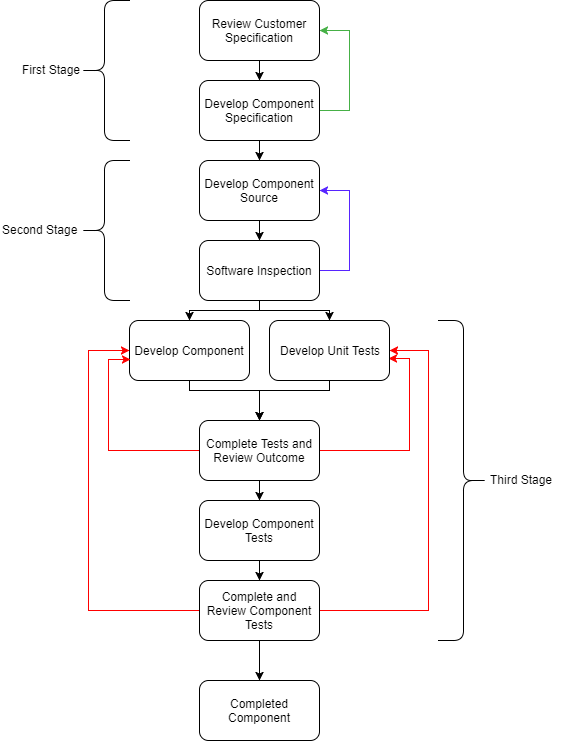

# Contents
1. [Introduction](#introduction)
- [Product Plans](#product-plans)
- [Process Descriptions](#process-descriptions)
  * [Login](#login) 
  * [Sanitise Text](#sanitise-text)
  * [High Score](#high-score)
- [Quality Goals](#quality-goals)
  * [Specific](#specific)
  * [Measurable](#measurable) 
  * [Achievable](#achievable)
  * [Realistic](#realistic) 
  * [Timely](#timely)
  * [Goals Associated with our Project](#goals-associated-with-our-project)
- [Risks](#risks)
- [Trello](#trello)
- [Conclusion](#conclusion)
- [Sources](#sources)

# Introduction

The objective of this document is to create a quality plan for testing of a game software development project. Testing is a crucial part in developing a piece of software that is of high standards, and to the client's specification because end-users in high risk scenarios, such as nuclear power plants, hospitals, etc, require dependable software to avoid disaster. This document will outline specific elements of the project which includes their order of implementation, tests that are carried out to ensure they work correctly and their measurable quality.
In addition to this, quality goals will be set for the project that will ensure a high-quality product at the end. This will include any potential risks that may affect the final product’s outcome and cause the goals to not be met.

In order to build a successful testing plan, different online communication tools have been used throughout the process including GitLab & Trello. GitLab is an online centralized server, where source code can be accessed and modified online by the developers and other contributors. Trello is a type of online collaborative tool that allow developers to keep track on the list of distributed tasks. These online tools allow developers to communicate more efficiently and keep their work consistent with each other’s.
Using these resources will allow the development team to easily keep track of the timeline of each task. This significantly reduces the risk of failure to meet time or budget constraints, as a more accurate prediction can be made at the beginning. The use of these tools has mitigated the risk of this, on this project.

# Product Plans

A project plan splits up the project into features. These features will be ordered by importance and relevance to the client's specification in order to fulfil the project's purpose and quality goals. This approach allows the features to be applied to test driven methods. These features could be used as milestones where periodic releases could be made to be tested and iterated upon. This aids the overall product quality because it allows for areas that might impact test design and implementation to be outlined allowing for iteration of the feature which therefore reduces the cost of fixing bugs later during development.

1.Web-based game

   * Users will play a Graphical Adventure

   * Users will solve puzzles

   * Users earn points for each solution

   * The Game will contain puzzles based on historical sources

   * Users knowledge in historical resources will be tested

2.Login, scores and sanitising databases

   * Users will be able to login with a valid username and password into their personal account

   * Passwords will be hashed for extra user account security

   * Users can save and view highscores in their personal area

   * Inputs to the "login" page will be compared to a database of naughty strings to sanatise inputs

3.Chat/Forum

 * Users can communicate and collaborate with others on their course

4.Feedback

 * Allows user to report and give feedback on the game

These features will make some of the core elements of the project. Features 1, 2 and 3 will cover the functional requirements of the project and will be subject to verification testing, the ramification of not implementing these requirements will result in a product that doesn't cover the requested purpose. Feature 4 will cover some of the testing and iteration which will help remove bugs cover the validation testing which is covered in the Quality goals section. These features have been ordered in this way due to how Feature 2 is dependent on 1 however using Automated unit testing will help relieve some of these dependencies. Feature 2 could require staff specialised in databases and security therefore impacting the test design. Feature 4 could require a management team to work through feedback and bring ideas of new features and improving the project adding more to the testing plans and implementing new features.

# Process Descriptions

A high level of quality is paramount in to software’s usability, and a well-defined process can help to achieve this. ISO 9001 is a certification for software that shows it followed a certain quality management system and requires that processes "will be aligned and understood by everyone". This provides a basis for the process of developing software and can lead to an efficient product that suits the customer's requirements.

 (Quality Plan, n.d.) Helped with this

The first stage of the process is to review the client's specification to ensure its known what is needed to be developed and contains all the client's requirements. The feedback loop ensures the specification is always met when planning for the component. This will be the carried out by senior developers in close consultation with the client (SSW Rules, 2018) to continually improve the specification and give the client a clear indication of what is being developed for them. This ensures their needs are met and they are put first, a significant principle of ISO 9001 (International Organization for Standardization, 2018). 

The second stage of the process is to ensure the correct preparation of the programming's source code, before being implemented and tested. This includes a feedback loop that develops the source code after inspection, to ensure errors and deviations from the specification and the standard are not present (IEEE Standard for Software Reviews, 2008). The source code will be written by a team of developers and inspected by the lead software engineer with a checklist of common errors (Parslow, Ch24 Quality Management, 2018). These inspections can only check conformance of the specification, and not the user's real requirements (Parslow, Ch8 Testing, 2018). Due to this, the specification development stage is of significant importance to check nothing is missing from the specification and therefore the source code. 

The third stage of the process represents the development of the component and testing of it. This will be approached by using test-driven development (TDD), meaning the code will be tested as it's developed. This develops the code incrementally but ensures each part of the component will be working before the next part is developed. The testing will take the form of automated unit tests. These provide instant feedback when editing the code, by using a secondary compiler to ensure any changes to the code still pass the test. Automated unit tests are preferable over manual unit tests as they require less constant maintenance and are more efficient at finding errors quickly. This adheres to the quality goal of timely testing and will reduce potential costs from finding an error late resulting in changing a lot of code (3Pillar Global, 2015). These tests will both simulate expected inputs from the user that would reflect normal operation, as well as abnormal inputs that may cause the programme to crash (Parslow, Ch8 Testing, 2018). The diagram shows a feedback loop to represent TDD.
	The final part of the third stage is component testing. This is carried out to make sure each part of the component interacts with the other correctly and is important if multiple developers coded different parts. This will test the component interface that causes each part to be called as needed, against the specification for the programme (Guru99, 2018) (Parslow, Ch8 Testing, 2018). These tests also allow for a measure of properties for the programme that wasn't possible in the software inspections, such as speed, efficiency and usability.  An addition feedback loop is represented in the diagram to show that development of the component can continue if any test is failed.

## Login
```gherkin
Feature: User Logging in 
   In order to view and add scores to database 
   Users should login with a username and password 
   
Background:
   Given User is on the "Login" Page
   And function "attemptlogin" takes variables "username" and "hashedpassword".
   
Scenario Outline: User has inputs credentials 
    When User inputs <username> and <password>
    And User Submits
    Then password is hashed
    And function "attemptLogin" returns <Valid/Invalid>
    Given function attemptlogin returns Invalid
    Then show message "Incorrect Credentials"
    Given function "attemptLogin" returns Valid
    Then User's page and information is shown
    
    Examples:
    | username | hashedpassword | Valid/Invalid |
    | False    | False          | Invalid       |
    | True     | False          | Invalid       |
    | True     | True           | Valid         |
```

## Sanitise Text
```gherkin
Feature: Sanitising User Entered Text

Background: 
    Given User is on the "Login" Page 
    And function "sanitiseText" is implemented

Scenario Outline: User inputs text
    Given User entered <username> and <password>
    And User Submits
    Then function "sanitiseText" outputs <Matching/Not>
    Given function "sanitiseText" returns Matching
    Then show message "Incorrect Credentials"
    Given function "sanitiseText" returns Not
    Then call function "attemptLogin"
    
    Examples:
      | username | pasword | Matching/Not |
      | Harmful  | Not     | Matching     |
      | Not      | Harmful | Matching     |
      | Harmful  | Harmful | Matching     |
      | Not      | Not     | Not          |
```

## High Score
```gherkin
Feature: High Score

Background: 
    Given user has finished game
    Then prompt user with message 'Do you want to enter high score?' or 'View high scores'
    
Scenario: User wants to input high score
    Given user wants to log new high score
    When user selects 'Yes'
    Then call function "getHighscores"
    And function "addHighscore"
    
Scenario: User does not want to input high score
    Given User does not want to log high score
    When User selects 'No' 
    Then delete high score

Scenario: User does not have high score
    Given User does not have high score
    When User selects 'View high scores'
    Then call the function "getHighscores"
    And high scores are shown

```

The above is an example of component testing that would be implemented during the development of the login component, the high score component and the component required to sanitise a user's input. These tests explain what should happen with the component, after specific given scenarios. These are designed to test all cases of user input to ensure the component can handle them. As these were written in Gherkin code, they are easily understandable by everybody and allows for a clear representation of the process. This is an important aspect of ISO 9001. 

The quality is determined by the measurement of the project against its specification, and how well it's been met, according to ISO 9001. Despite this however, the specification may be too vague or misses key parts to make the software be useable, reliable and efficient. In these instances, there should be a greater focus on its 'fitness for purpose' rather than a strict conformance to the specification. 


# Quality Goals

The tests will show the presence of bugs in the development of the game. The test cases will cover the three aspects of whether a user enters the correct or incorrect password; whether they want to add a new high score and sanitising the text they enter. 

The principles of testing will act as a guideline to follow when the tests for the game are being created and implemented. These include: 

* Testing will show the presence of defects
* It is not possible to over test
* Testing must be done early
* Defect Clustering 
* Pesticide Paradox 
* Testing is context dependent
* The software cannot be completely bug free

## Specific

If the test cases do not pick out any defects, it may not mean the tests are correct and the game is bug free. The outcomes of each test must be clear hence why we used the Gherkin language to properly break down potential bugs. The tests should be treated with the same etiquette as the production code for the game -
such that, if someone else came in and wanted to see the how the tests were being created and implemented, they would not have much trouble. This should also help the original tester especially if they have not seen the tests for a while. 

## Measurable 

If the test cases continue to pass, again and again, then they are not required anymore in the software life cycle. This is a stage called 'pesticide paradox' where new cases need to be made because the old cases are out of date, as the game may have evolved in that time. This process is called refactoring and should be after a few weeks or months, especially if the underlying code has been changed. 

## Achievable

It is in the department's best interests that the tests are not 'exhaustive' as this will drive up the costs. The testing team should analyse the risk factor involved of each part of the game. For example, sanitising user entered text could be given a higher rating of risk than the test case asking for valid or invalid login attempts. This is the principle of 'defect clustering' where a higher percentage of the focus is on one part of the software. The risk analysis part of the quality plan will address this issue. 

## Realistic 

It is impossible that the game will be completely correct and bug free, but the tests are made to eliminate as many defects as possible. When the test cases are run, they should encapsulate the variability of how quickly the user inputs text and what text is inputted. For example, at the user login page, a different message should appear depending on what the user has inputted. If they have left the fields blank, the page should not direct them to a 'welcome' screen as no data has been inputted. If data is inputted, the attemptLogin function should be called to 'welcome' them or return an incorrect username/password message.

## Timely

The tests should be implemented early in the software life cycle to catch any errors early on. This will prevent errors being found later by the developer once the code has been completed. If errors are caught early, it lowers the cost as less work is needed to find the error.

## Goals Associated with our Project

* By the beginning of the academic year, we will deliver a piece of educational software to the client. This will allow us to gain some recognition as a reliable software development team. We will use careful planning to ensure that we meet the timing constraints defined by the client.

* By the end of the second month of the project's lifecycle, we would have gained permission from the author of the relevant historical texts to use them in our application. Alternatively, we will negotiate with the project stakeholders to find alternative texts that we could use. This would ensure that the project is a suitable educational tool for use by students, therefore leaving the client satisfied with the product that we have produced.

* By the end of the third month of the project lifecycle, we would ensure that our staff is familiar with the technologies related to implement the database interfacing functionality specified in the brief, we would do this via hiring a relevant training provider. Alternatively, we would hire specialised staff specifically for this task, this would be the responsibility of the hiring manager. By doing this, we ensure that our software meets the client's expectations as an educational tool.

* We aim for the software deliverable to be usable and of high quality at release. We will ensure that this is the case by carrying out constant unit and integration testing on our solution. In addition, we will use planning techniques such as a quality plan to upkeep the quality of the project throughout the project lifecycle. This process will be carried out by everyone in the development team as to ensure that everyone is committed to upkeeping quality. By maintaining the quality of the project, the deliverable will be a more robust solution and more likely to meet the client's expectations.

* The codebase of the project should be consistently maintainable. We will achieve this by using tried-and-tested programming patterns and ensuring that each developer is familiar with our programming standards in regards to how code should be commented and structured. By doing this, we will ensure that the project can be further developed in the future, regardless of who is doing so.

* The deliverable should perform as expected on low-power devices such as mobile phones or school computers, this would ensure that the software remains usable regardless of what device a student is using. To do this, a developer may need some background knowledge on the development of web applications and how to properly optimize them. By extension, this would ensure that the software is very portable. By doing this, we ensure that the product remains a viable educational tool and, by extension, satisfies the client to a higher degree.

* The deliverable should be secure in terms of preventing users from taking advantage of exploits to gain an unfair advantage - particularly on the leader board. In our quality plan, we have employed input sanitisation as a measure to prevent this. We should also use techniques such as server-side verification to further protect against this. By doing this, we ensure that our software is robust and further usable regardless of the environment in which it is used.

# Risks

There are several factors that could negatively influence the quality of a project over its lifetime – these are known as risks. The identification, analysis, and management of these risks is fundamental to the development of high quality software.

To quantify a risk, it must first be identified. There are a range of techniques that an engineer could use to identify risks. For example, a risk could be derived from the requirements defined by the project stakeholders, such as a stakeholder requiring that a project use an unfamiliar technology. Alternatively, an engineer could use their own experience in software engineering to identify risks that could affect a project over its lifetime.

Once a risk has been identified, it must be analysed. The engineer should sort and index risks according to traits such as their severity to the project were they to occur. The engineer should also consider why a risk could occur in the first place. The purpose of risk analysis is to allow for more robust management techniques to be established in the next step.

Risk management is a process that is continuous throughout the lifecycle of a software project. In this step, the engineer should establish a comprehensive risk management plan that would be an effective tool for maintaining the quality of said software project. Thus, a risk management plan should include information such as the actions that the engineer would take were a risk to occur, and how this would mitigate the effect of the risk on the project. 
The mismanagement of risks is likely to have a detrimental effect on a software product. For example, a project could fail to reach the specifications defined by the project stakeholders as the result of risks; this could leave a client unsatisfied with the product.

The table below shows the risks that we have identified within our software project. Some of the risks have been discussed in more detail below the tables.

_The structure of these tables vaguely follows ISO 9001. We do not follow it strictly as to include more information in the tables._

| Risk | Severity | Probable Cause |    Probable Effects    |
|---------------------------------------------------------------------:|----------|----------------------------------------------------------------------------------------------------------|-------------------------------------------------------------------------------------------------------------------------------------------|
| Failure to meet time constraints | Medium | Incorrect time estimations / Mismanagement of staff and other such resources | Software may not launch in time / Software may launch in a broken state    |
| Failure to meet budget constraints | Medium | Incorrect budget estimations / Mismanagement of monetary resources | Inability to pay staff / Lack of budget to expand project    |
| Insufficient time to implement proper database interfacing | High | Lack of specialised staff / Unfamiliarity with modern technologies | Missing core functionality as defined by stakeholders    |
| Lacking permission to hardcode historical texts into the application | Medium | Lack of funding / Inability to gain permission from author of original text | The application may not act as an effective learning tool    |
| The finalised project has an unmaintainable codebase | Medium | Lack of communication between developers / Use of ineffective software architectural designs or patterns | More difficulty expanding the project in the future / The project cannot be used by the developer as a reference in the future    |
| The deliverable isn’t what the client expected | High | Conflict between stakeholders / Low quality input from the stakeholder | The functionality offered by the deliverable may be inconcise or inapplicable / The software may not be suited for its target audience    |

| Risk | Management Technique |
|----------------------------------------------------------------------|-------------------------------------------------------------------------------------------------------------------------------------------------------------------------------------------------------------------------------------------------|
| Failure to meet time constraints | Make use of planning techniques such as a Gantt chart to manage tasks and allow staff to visibility see deadlines |
| Failure to meet budget constraints | Carefully plan the use of monetary resources within the project / Ensure that the scope of the project does not increase exponentially over time / Constantly refer to stakeholders to ensure that money is being spent  effectively. |
| Insufficient time to implement proper database interfacing | Consider hiring specialised staff to implement database functionality / Otherwise, ensure that the client and server applications are built in unison / Ensure that existing staff receive training on how to use unfamiliar technologies |
| Lacking permission to hardcode historical texts into the application | Consider negotiating with stakeholders to ensure that their requirements in terms of historical texts are usable / Be sure that the client will inform the engineers in cases where they change what texts they want to embed into the software |
| The finalised project has an unmaintainable codebase | Consider developing a standard styling guide for the project / Be sure to include relevant comments in the source code / Ensure that the developers are in constant cooperation as to mitigate the risk of a codebase becoming ‘spaghetti’ |
| The deliverable isn’t what the client expected | Ensure that a robust set of requirements is collected during the beginning of the project lifecycle / Keep the client engaged with the project and be sure to consider their input |

(Mar, 2016)

Regarding time constraints, while the brief does not specify a time frame for the project, it should still be completed within a reasonable period. Since the software is oriented at students it should be ready for deployment close to the start of an academic term, this would ensure that students can have as much time as possible using the application. However, the engineer should note that software quality should not be sacrificed to push out the product quickly. Coming up with a suitable timetable for the project is important as it allows time to deal with unexpected circumstances. Failing to anticipate such events could lead to failure of the project.

Regarding a failure to meet the defined budget constraints, while a budget has not been mentioned, a list of potential costings should be considered to ensure stakeholders know how much the project will cost. Some examples of costs that should be considered includes database and web storage as the brief suggests a forum or online chat for users to collaborate and discuss with course mates. If a development team did not meet budget constraints, they may fail to pay staff. This could result in staff slacking off or not coming in at all, this would impact the quality of a project.

There are many real-life instances of software causing dangerous situations due to unsatisfactory risk assessment during the project lifecycle. For example, between 1985 and 1987, patients with cancer were treated using radiotherapy by a machine which gave them doses of ionising radiation to treat the suffering part of the body - this delivered a safe dosage of around 5000-10000MeV (mega volts). However, due to bugs in the system, some patients received an overdoses of up to 20000MeV (Fabio, 2015). These patients either soon died or suffered life changing injuries. An investigation into the accidents uncovered that previous generations (Therac-20) of the machine had the same problem, but was protected by a piece of hardware which was removed as the machine evolved. This highlights the importance of rewriting test cases if a program has changed or time has passed. In relation to the game for students, the test case - sanitising user entered text - is perhaps the most critical to get right to avoid SQL attacks which are commonplace where security is poor and data is present. If the sanitation test does not provide protection, changes can be made before a hacker gets the opportunity to breach the database and access student accounts by typing out an SQL statement at the login phase of the game.

# Trello

The Kanban software provided by Trello was used to help keep track of the workflow in this quality plan, as can be seen in the screenshots. The categories to do, doing and done made it clear for to the team to visualise the stages of completion of each task in the quality plan, along with who was doing them. The fact big companies like Sony use Kanban software for their projects solidified the decision to use it for the quality plan. The level of organisation at this stage will reflect in the final product of the quality plan as to whether we have met or exceeded the customer's expectations - poor organisation would result in a poor quality plan. The Trello software was more efficient than using a paper based board as it allowed the team to communicate remotely without having to meet up constantly - which is also why GitLab was used extensively. Any member of the team was able to add a card to the board to inform other members what the task was and who was doing it via the labels. 


# Conclusion

In conclusion, a lot of time and preparation is required to ensure the software is a high quality product. This includes extensive research into the goals and risks of the project, as well as a clear testing and process plan for elements within it.

# Sources
3Pillar Global. (2015, September 15). Agile Best Practices: Automated Unit Tests. Retrieved from YouTube: https://www.youtube.com/watch?v=VDKS0-tUMQI

Build Realistic Testcases. (2012, January 3). Retrieved from webperformance: https://www.webperformance.com/load-testing-tools/blog/2012/01/build-realistic-testcases/

Fabio, A. (2015, October 26). KILLED BY A MACHINE: THE THERAC-25. Retrieved from HACKADAY: https://hackaday.com/2015/10/26/killed-by-a-machine-the-therac-25/

IEEE Standard for Software Reviews. (2008, August 15). Retrieved from The Computer Society: http://profs.etsmtl.ca/claporte/English/Enseignement/CMU_SQA/Notes/Revues/IEEE_Std_1028_Reviews.pdf

International Organization for Standardization. (2018, February 9). ISO 9001:2015. Retrieved from https://www.iso.org/files/live/sites/isoorg/files/standards/docs/en/iso_9001.pptx

Learn COMPONENT Testing with Sample Test Cases. (2018, February 9). Retrieved from Guru99: https://www.guru99.com/component-testing.html

Mar, A. (2016, June 28). 130 Project Risks (List). Retrieved from simplicable: https://management.simplicable.com/management/new/130-project-risks

Parslow, P. (2018, February 9). Ch24 Quality Management. Retrieved from https://www.bb.reading.ac.uk/bbcswebdav/pid-3668193-dt-content-rid-9688810_2/xid-9688810_2

Parslow, P. (2018, February 9). Ch8 Testing. Retrieved from https://csgitlab.reading.ac.uk/CS-2017-18-Part1/CS1SE16/cw3-tests/November/cw3/uploads/5ca8898066d5ec27344b9a74d42630fa/Ch8.Testing.pptx

Prevent Web Attacks Using Input Sanitization. (2012, October 26). Retrieved from eSecurity Planet: https://www.esecurityplanet.com/browser-security/prevent-web-attacks-using-input-sanitization.html

Quality Plan. (n.d.). Retrieved from BlackBoard: https://www.bb.reading.ac.uk/bbcswebdav/pid-3668194-dt-content-rid-9688812_2/courses/CS1SE16-17-8A/Quality%20Plan%20BB.pdf

Reference. (2018, February 9). Retrieved from Cucumber: https://cucumber.io/docs/reference

Reid, J. (2017). 3 Reasons Why It’s Important to Refactor Tests. Retrieved from Quality Coding: https://qualitycoding.org/why-refactor-tests/

Rules to Better Specification Reviews. (2018, February 9). Retrieved from SSW Rules: https://rules.ssw.com.au/rules-to-better-specification-reviews

Seven Principles of Software Testing. (2018, February 9). Retrieved from Testing Excellence: https://www.testingexcellence.com/seven-principles-of-software-testing/

Sheffer, J. (2017, May 14). Gherkin Best Practices. Retrieved from YouTube: https://www.youtube.com/watch?v=nrggIRWK6qo

Software Testing Tutorial. (2018, February 9). Retrieved from tutorialspoint: https://www.tutorialspoint.com/software_testing/index.htm

USING FREE TEXT PARAMETERS. (2018, February 9). Retrieved from Hiptest: https://docs.hiptest.net/using-free-text-parameters/

What Is Input Validation and Sanitization? (2018, February 9). Retrieved from Oracle: http://download.oracle.com/oll/tutorials/SQLInjection/html/lesson1/les01_tm_ovw3.htm

writing features - gherkin language. (2018, February 9). Retrieved from behat: http://docs.behat.org/en/v2.5/guides/1.gherkin.html